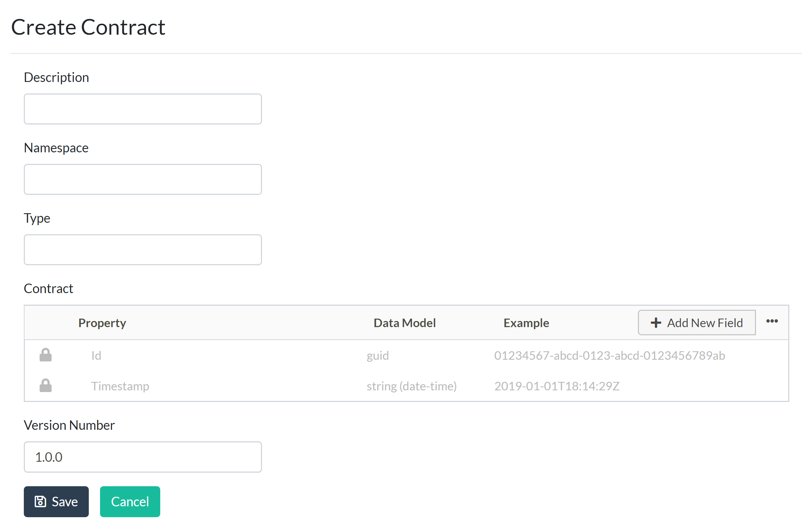
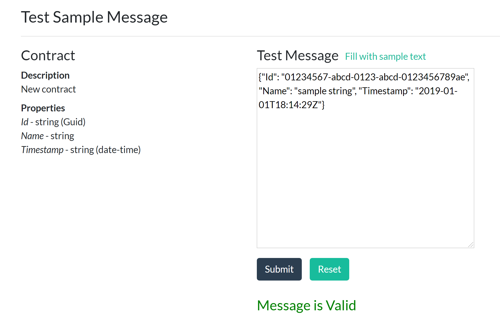

# Totem

<h4 align="center">Don't break your consumers - Test your microservices contracts</h4>
Totem is a tool for testing the contract (message format) used by both producers and consumers; primarily for messaging used in distributed systems (like microservices). Once deployed, the Totem API will allow for automated message testing for both providers and consumers, and a GUI for manual testing by developers. Users can also view existing contracts through the GUI.

## Usage

1. Deploy Totem somewhere accessible to your project's build server
2. Create an account using the link at top right in the home screen
3. Use the Totem UI to define the contracts you plan to test (you must be authenticated)
4. Write tests that run on your build to hit the Totem API, using the contract ID and a sample message
5. If the tests fail, the build should fail, since it will be incompatible with the contract definition

## Features



**The UI allows:**

- Adding contract definitions (all metadata fields are required)
  - Description - description of schema
  - Namespace - fully qualified name to help naming conflicts
  - Type - type of schema
  - Contract - OpenAPI format JSON string describing the schema (controlled by a visual editor, or the string can be edited manually)
    - ID and Timestamp are required fields for all contracts
  - Version Number - version of schema, using Semantic Versioning
- Editing contracts
- Deleting contracts
- Viewing contract details
- Downloading contract schema - saves as .txt file with contract id as name of file
- Testing validity of contract schemas with sample messages
  - 'Fill with sample text' will pre-populate message with sample text to submit and validate against



### Testing contracts manually via Postman

Example of running Totem locally, and hitting the API with Postman:

- _POST_ to `https://localhost:5001/api/TestMessage/` (Totem API URL)
- Body: (raw), type JSON

  ```
  {
      "ContractId": "8f466572-2dd4-47fb-4417-08d6e901c90a",
      "Message": {"ID": "00000000-0000-0000-0000-00000000000", "Timestamp": "5/6/2019"}
  }
  ```

- Example valid Contract String, using the OpenAPI schema format:
  ```
  {
      "Contract":{
          "type":"object",
          "properties":{
              "Id":{
                  "$ref": "#/Guid"
              },
              "Timestamp":{
                  "type":"string",
                  "format":"date-time"
              }
          }
      },
      "Guid": {
          "type": "string",
          "pattern": "^(([0-9a-f]){8}-([0-9a-f]){4}-([0-9a-f]){4}-([0-9a-f]){4}-([0-9a-f]){12})$"
      }
  }
  ```

### Testing a producer/consumer via Totem API

To test the validity of messages as a producer/consumer through the Totem API, we will need to add tests to a new/existing project, while specifying the contract ID and sample message.

- Using the Totem UI, create a contract for the message you need to test against. Ex: Let's say you have a shopping cart feature and need to test an order message to ensure the contents are valid. And let's say for simplicity that the order message consists of the following fields:
  1. OrderId
  2. ItemName
  3. Total
  4. Timestamp
- Contract string defined in the Totem UI would be:

```
{
    "Contract": {
        "type": "object",
        "properties": {
            "OrderId": {
                "$ref": "#/Guid"
            },
            "ItemName": {
                "type": "string"
            },
            "Total" : {
                "type": "integer"
            },
            "Timestamp": {
                "type": "string",
                "format": "date-time",
                "example": "2019-01-01T18:14:29Z"
            }
        }
    },
    "Guid": {
        "type": "string",
        "pattern": "^(([0-9a-f]){8}-([0-9a-f]){4}-([0-9a-f]){4}-([0-9a-f]){4}-([0-9a-f]){12})$",
        "minLength": 36,
        "maxLength": 36,
        "example": "01234567-abcd-0123-abcd-0123456789ab"
    }
}
```

- For the new contract that was just created, retrieve the "Contract ID" which will be used to denote which template our message needs to be validated against.

  - To retrieve the contract id, on the Totem UI, click the 'Details' link on the contract that you want to test. The details page will list the "Contract ID" value.

- Now we need to add tests to ensure the message is valid, using either a new/existing application.

- The tests will make a call to the Totem API with the contract ID and sample message.

- Below is an example snippet for testing the validity and success of a message schema:

  ```
  var anonymousOrderMessage = new
  {
      ContractId = Guid.Parse("replace-with-actual-guid-id-from-above"),
      Message = new
      {
          OrderId = placeOrder.OrderId,
          ItemName = placeOrder.ItemName,
          Total = placeOrder.Total,
          Timestamp = DateTime.Now
      }
  };

  var stringContent = new StringContent(JsonConvert.SerializeObject(anonymousOrderMessage), Encoding.UTF8, "application/json");

  var client = new HttpClient();
  var response = await client.PostAsync("https://localhost:5001/api/TestMessage", stringContent);

  response.EnsureSuccessStatusCode();
  ```

  - NOTE: Replace the Contract ID in the message and api url in the PostAsync(...) with the exact values being tested against.
  - Ex: Totem API Url could be: `https://localhost:5001/api/TestMessage/`

- To test that a message is invalid, you could simply use the same message above, but this time, include another field that isn't specified in the contract to see the results of the call, like so:

  ```
  var invalidAnonymousOrderMessage = new
  {
      ContractId = Guid.Parse("replace-with-actual-guid-id-from-above"),
      Message = new
      {
          OrderId = placeOrder.OrderId,
          ItemName = placeOrder.ItemName,
          Total = placeOrder.Total,
          Timestamp = DateTime.Now,
          NonExistentField = "This should not validate"
      }
  };
  ...
  ...
  ```

- The above were just two examples of testing a valid and invalid message thru the Totem API. Of course, feel free to test against the API how you see fit, but hopefully the examples above help get you started.

- If there was a need to include a new field in a contract, edit the type for an existing field, or delete a field on the contract schema, we would do so by updating the contract in the Totem UI. Then, re-run the tests to ensure their validity.

- The ideal scenario for using Totem would be to add these tests into your build, so that before a publish or deploy, you are aware if your code is out of compliance with the expected contract, giving you a heads-up before potentially pushing breaking changes.

## Installation

### Prerequisites

- **Git**
- **Visual Studio 2017**
- **Node v11.14.0/NPM v6.9.0** - If you have a different version of Node/NPM installed, I recommend using [NVM for Windows](https://github.com/coreybutler/nvm-windows) to manage Node/NPM versions
- **[.NET Core 2.1 SDK](https://dotnet.microsoft.com/download/dotnet-core/2.1)**
- **[SSMS](https://docs.microsoft.com/en-us/sql/ssms/download-sql-server-management-studio-ssms?view=sql-server-2017)** (optional, but handy)
- **SMTP Server** For user account management and password recovery (the default configuration for development environment works with Papercut https://github.com/ChangemakerStudios/Papercut)

### Getting Started

1. Clone this repository
2. Using a command prompt from the project folder run `.\build` to run the build script and initialize the DB
3. From the /src/Totem folder, run `npm i` to install node modules
4. Open the solution in Visual Studio, and run Totem as a service instead of with IISExpress (select Totem from the Run dropdown)
5. Accept the SSL certificate warning if prompted

### Front End Development

Most of the application's UI is built in C#, but components that require special interaction (like the contract string editor) are built in JavaScript using [Vue](https://vuejs.org/).

**Dev environment recommendations**

- VSCode is the recommended text editor
- Install the extensions ESLint, vue, and Prettier - code formatter, Bracket Pair Colorizer
- Consider setting your local settings:
  - Ctrl-comma to open your settings
  - Type "settings" in the search bar
  - Change "Workbench > Settings: Editor" from "ui" to "json"
  - Type "use split json" in the search bar
  - Check the box for "Workbench > Settings: Use Split JSON"
  - Now when you do Ctrl-comma to open your settings, you will see the application defaults and user settings side by side in JSON
  - Consider adding the following to your user settings on the right:

```
  "editor.renderWhitespace": "all",
  "editor.tabSize": 2,
  "editor.formatOnSave": true,
  "eslint.alwaysShowStatus": true,
  "eslint.validate": [
    { "language": "vue", "autoFix": false },
    { "language": "html", "autoFix": false },
    { "language": "javascript", "autoFix": false }
  ]
```

**Running locally**

Debugging the Totem application (either through Visual Studio or from the command line, using `dotnet run` will automatically build and run the webpack dev server, transpiling and generating the javascript files needed by the front end. If you use the command line to debug, it will not automatically launch a browser window for you, but you can find the port it is running on in the console output:
`Now listening on: https://localhost:5001`.

**Tests**

To run javascript logic tests, on the command line from the src/Totem folder, run `npm run test`.

To run end-to-end tests using [TestCafe](https://devexpress.github.io/testcafe/), on the command line from the src/Totem folder, run `npm run e2e`.

## Contributing

- Commits should not be made directly to `master`.
- Branch or fork from `develop`, and name your branch starting with the issue number. Ex: `10_Feature_description`
- Create a PR to merge your branch back to develop
- When code is ready to deploy, develop can be merged to master.

## Credits

Designed and built by [Headspring](http://www.headspring.com)

## License

[MIT](https://opensource.org/licenses/MIT) © [Headspring](http://www.headspring.com)
